# DevWebCamp

DevWebCamp es una plataforma web para la gestión y promoción de eventos, conferencias y workshops relacionados con el desarrollo web y la tecnología.  
El proyecto permite administrar usuarios, eventos, ponentes y pagos, ofreciendo una experiencia completa tanto para organizadores como para asistentes.

---

## 🛠 Tecnologías

- PHP (Arquitectura MVC)
- MySQL
- JavaScript (ES6+)
- HTML5
- CSS3 / SCSS
- Gulp
- Composer
- PayPal API
- Dotenv

---

## 📸 Capturas

### 🏠 Home
Vista principal del sitio y navegación general.

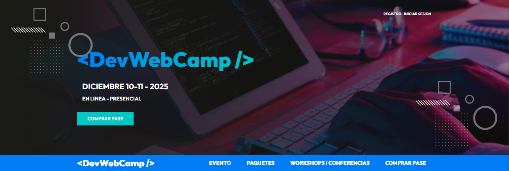
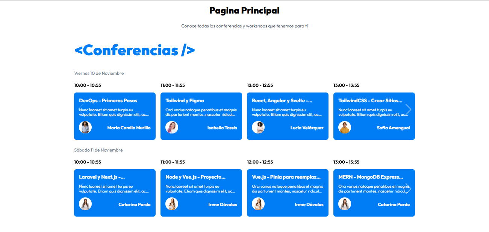
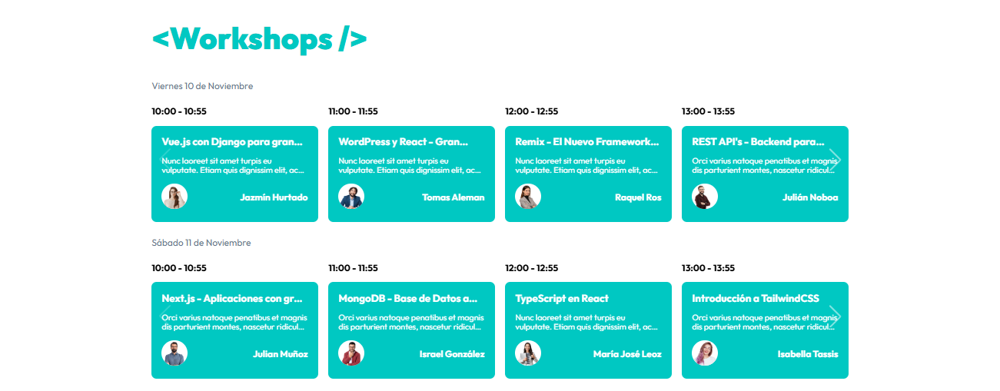

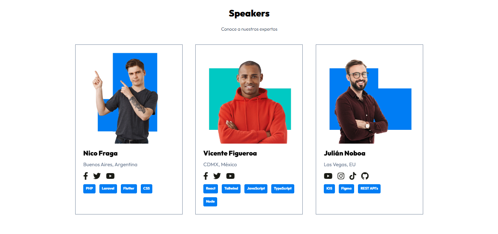
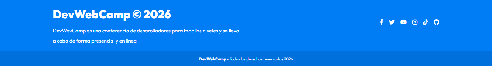

---

### 👤 Usuario
Flujo de registro, autenticación y acceso a funcionalidades para usuarios.


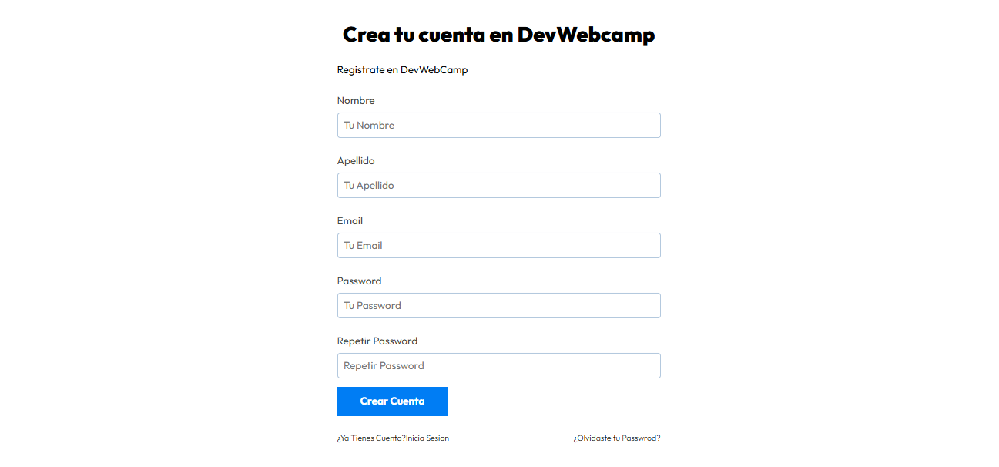

**Finalización de registro**
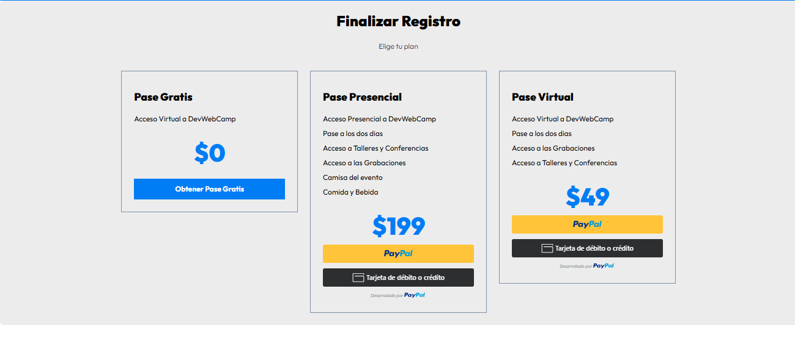
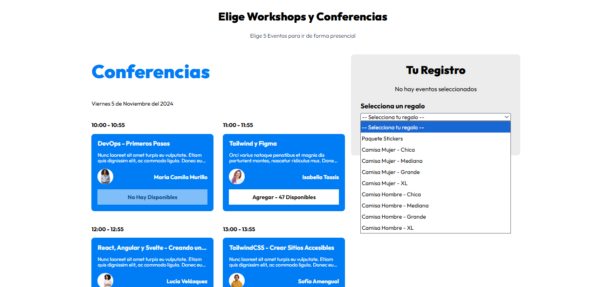


---

### 🛠 Panel de Administración
Gestión de eventos, ponentes y usuarios desde el panel administrativo.

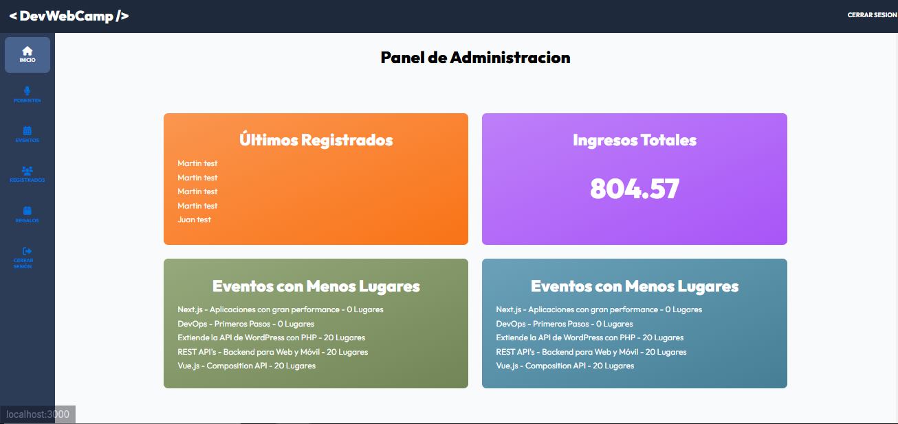
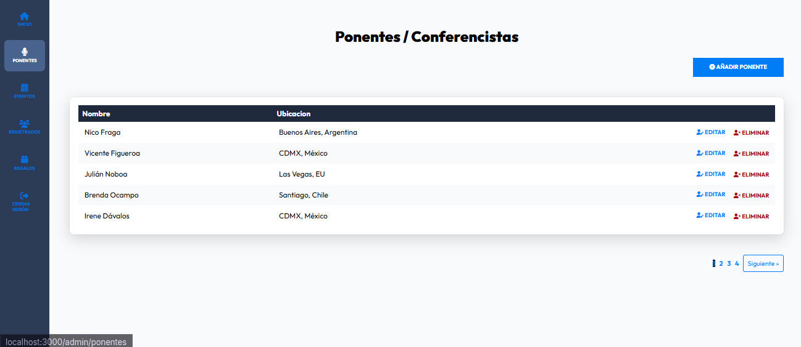
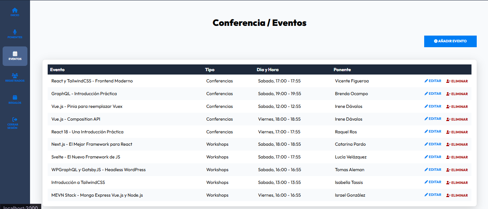
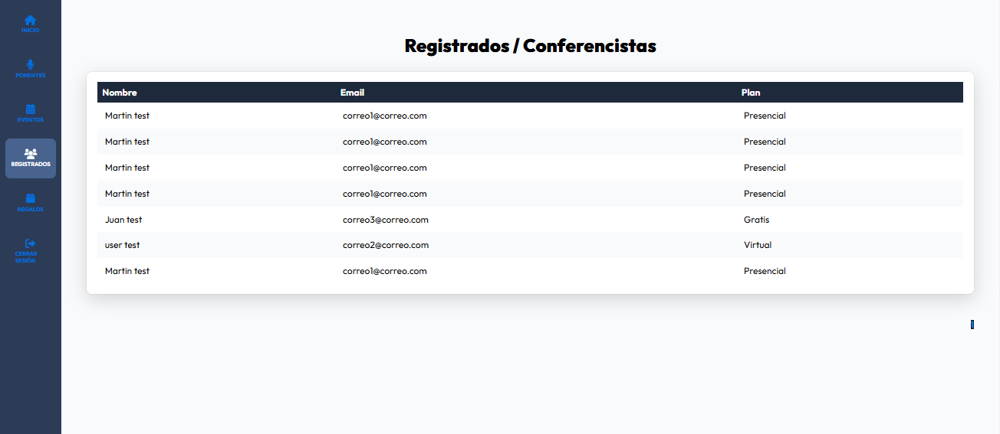
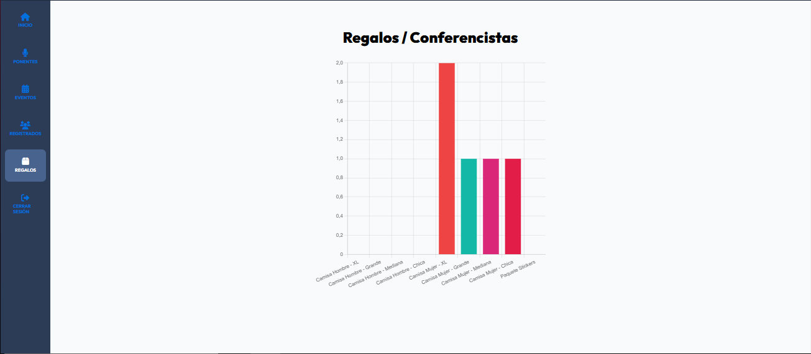
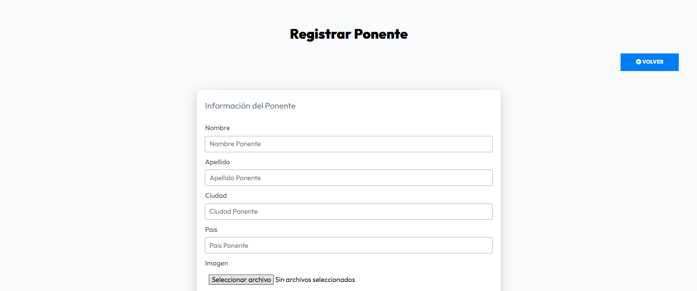
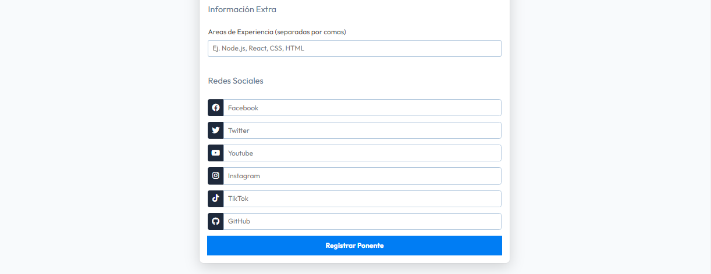
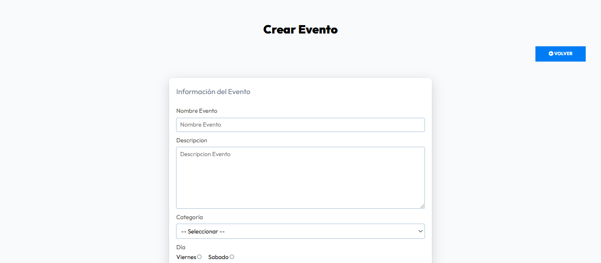
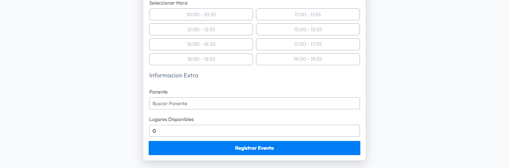


---

## ⚙️ Instalación del proyecto

### 1️⃣ Clonar el repositorio
```bash
git clone https://github.com/Maty1337/DevWebCamp.git
```

### 2️⃣ Acceder al proyecto
```bash
cd DevWebCamp
```

### 3️⃣ Instalar dependencias PHP
```bash
composer install
```

### 4️⃣ Instalar dependencias de frontend
```bash
npm install
```

### 5️⃣ Compilar assets
```bash
gulp
```

### 6️⃣ Configurar variables de entorno
Crear un archivo `.env` basado en `.env.example` y configurar base de datos y PayPal.

### 7️⃣ Importar la base de datos
Crear la base de datos en MySQL e importar el archivo `.sql`.

### 8️⃣ Levantar servidor

``` bash
php -S localhost:3000
```

---

## ✨ Funcionalidades

- Registro e inicio de sesión de usuarios
- Gestión de perfiles
- Administración de eventos y ponentes
- Sistema de compra de entradas
- Integración con PayPal
- Panel de administración
- Protección de rutas y permisos
- Arquitectura MVC escalable

---

## 👨‍💻 Autor

**Matías Buenaventura**  
Desarrollador Web Full Stack Jr.  
GitHub: https://github.com/Maty1337
